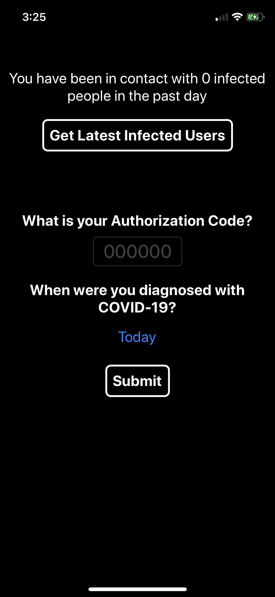

# dp3t
An implementation of the DP3T contact tracing protocol. You can find more about the original proposal, white paper, and code at https://github.com/DP-3T/.

DP3T is a privary preserving contact tracing protocol that can help users know if they have been exposed to a virus. It was designed in the context of
COVID 19, but in theory could be used for any pandemic. The following is an outline of how it works:

1. Users download the app
2. Generate an initial secret key.
3. Generate a list of ephemeral ids deterministically from the secret key.
4. Adverise your ephemeral id over Bluetooth Low Energy (BLE). Every 15 minutes, use a new ephemeral ID from the list.
5. Scan for devices over BLE. Make note of any ephemeral IDs that you see along with a coarse indication of time (the current day would suffice).
6. Every day, generate a new secret key deterministically off the initial. Then, generate a new list of epehemeral ids.
7. If a user tests positive for COVID 19, they self-report on the app. They also identify when they first were exposed (and could have been exposing other people). This send their (secret key, coarse time of exposure) to the backend server. Then, they generate a new random secret key.
8. The backend server collects these secret keys and coarse times throughout the day. It uses this data to create a daily distribution list of secret keys of people with the virus.
9. Periodically, users will pull from the server to get the latest list of (secret key, coarse time of exposure). For each key, the following procedure is done by each device:
    - make note of the coarse time of exposure
    - construct all possible ephemeral ids that could have been broadcasted (the algorithm to do this is deterministic, so each device can determine this given the secret key)
    - check to see if it has seen any of those ephemeral ids
    - if there is a match, notify the user
    - otherwise, increment the coarse time of exposure to the next day. Evolve the secret key using the determinstic algorithm in #6. Repeat these steps until the current day.

There are a few key important outcomes from this design, namely:
- There is no GPS tracking
- The app runs in the background, so users do not need to keep the app open at all times
- The backend only knows about infected user IDs, which themselves are randomly generated by each smartphone. Conseuqently, the backend has 
no way of knowing which person reported themselves as infected. Also, when a user reports themselves as being infected, they generate a new ID.
This means no one can track the user after getting their ID once.
- The backend does not know who was exposed, because the backend is only ever notified when someone reports themselves as having tested positive.

We wrote a minimal implementation of DP3T that includes its most important features.

# Features
- random initial secret key
- random ephemeral ids
- scan/advertising for ephemeral ids using BLE *in the foreground only*
- self-reporting
- a backend server that can handle self reports and create a daily distribution list
- create a new random secret key after self reporting
- notification of the number of times you have been exposed to the virus

Screenshots:  

# Limitations
- The app only works in the foreground, due to Apple's restrictions on using Bluetooth in the background. They made an Exposure Notifications API
after DP3T came out to allow certain *licensed* apps to use Bluetooth resources in the background.
- Only works on iOS devices.
- The daily distribution list is served by the server, but it could be served via CDN because it is fairly static. This would scale much better.
- The authorization code does not actually do anything.

# Try it out
The backend server code can be found in `dp3t_server`. There is a README on instructions for local development and deployment.

The iOS code can be found in `iosApp`. There is a README on instructions.
